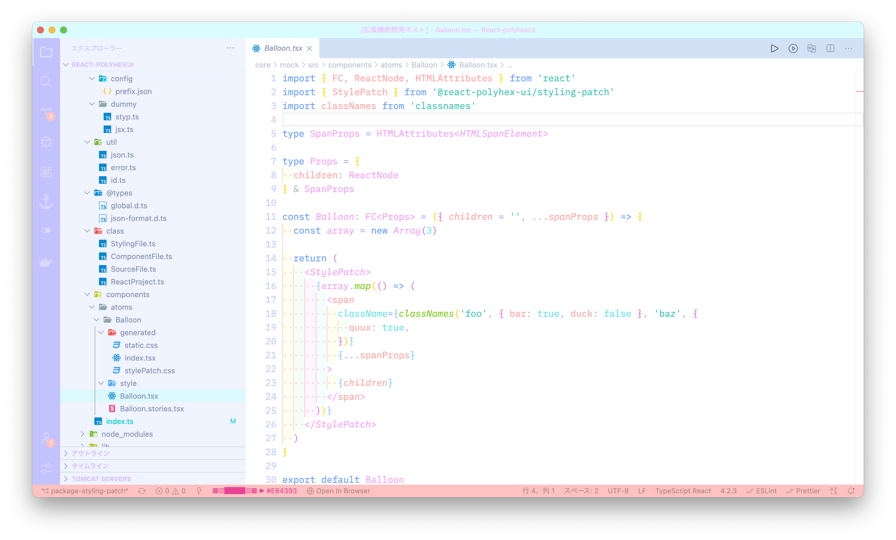
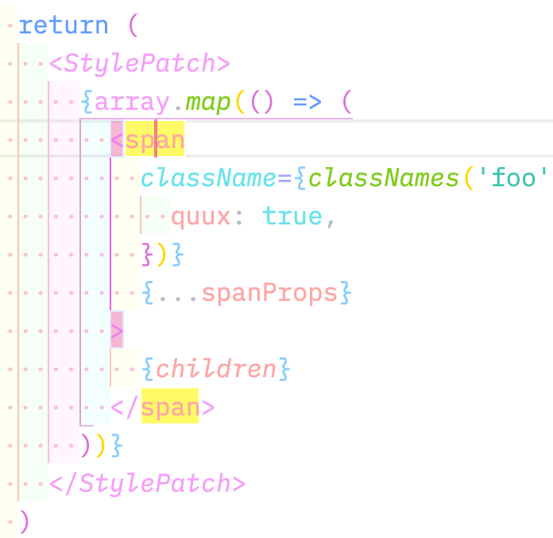
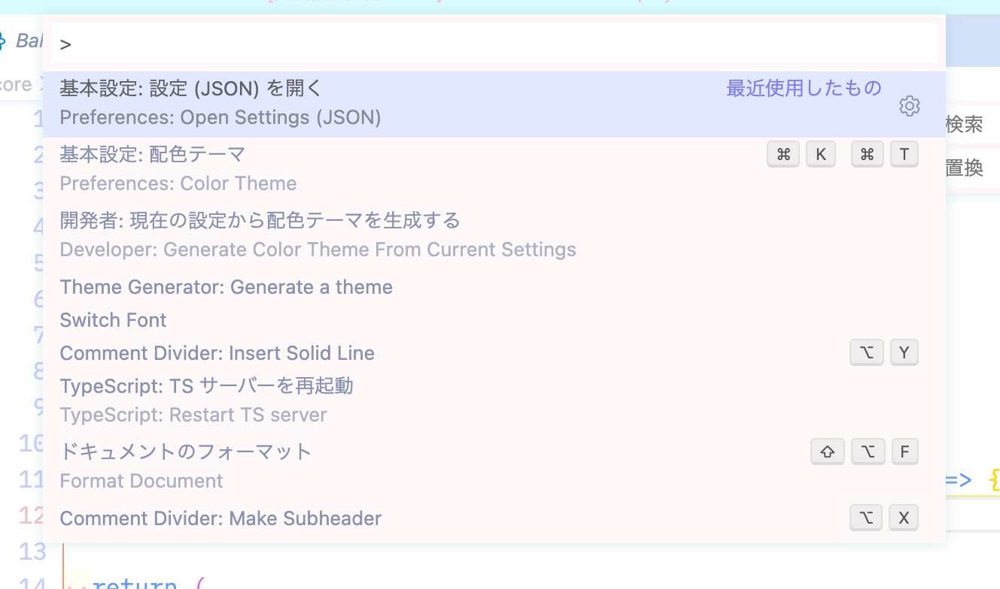
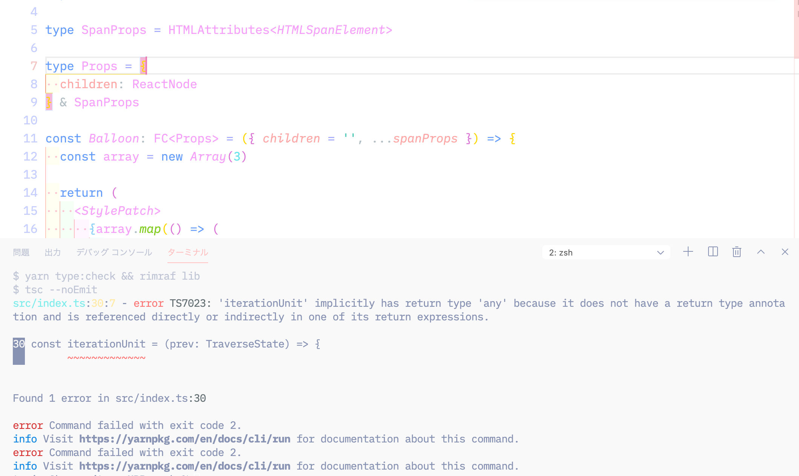

# PastelFairy

This is Color Theme for Visual Studio Code

## Fragile, lovely colors

## Easy to find focus keywords and matching braces

## Widget with drop shadow

## Unobtrusive terminal keeps you focused on editing code

---

## Fonts used in the image

https://github.com/IBM/plex

## Creator of this extension

**tomixy** is a Japanese web developer born in 2002

[Click here for biography](https://tetracalibers.notion.site/tetracalibers/React-polyhexUI-30b94fb9fc054d4da667539ef35f42c6#bc6da2aa652745ecb834ca5d33e0fd90)
